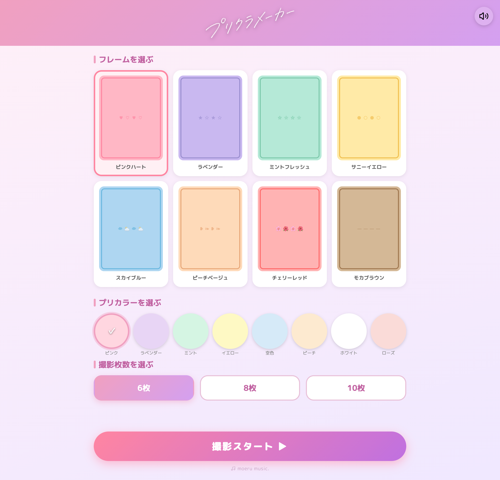
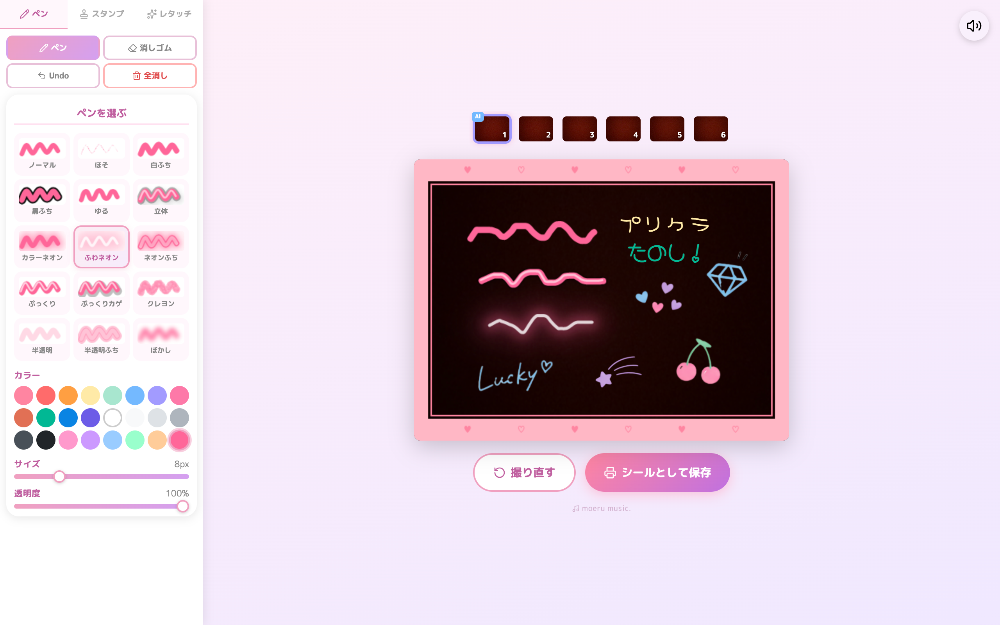
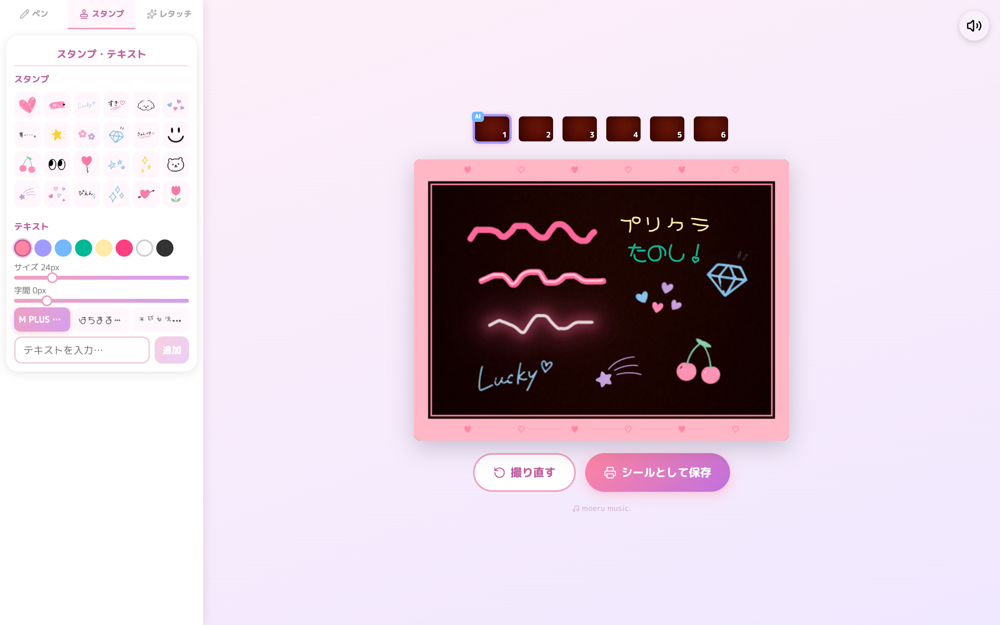
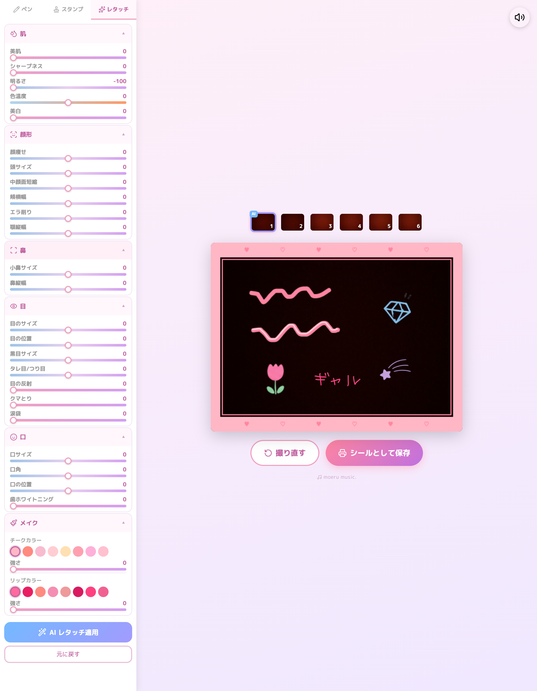
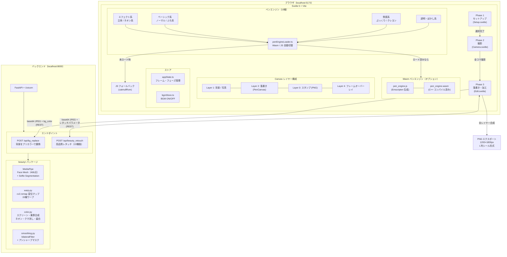

# プリクラメーカー

プリクラアプリをフルスクラッチで実装したポートフォリオ作品です。  
カメラ撮影・AI 顔加工・背景置換・落書き編集・スタンプ・シール出力（画像保存）までをローカルで一貫して動作させています。

**注意:** 複数人撮影した際の顔加工の検証がまだできていません。

---

## スクリーンショット

| セットアップ | 落書き（ペン） |
|:-----------:|:-------------:|
|  |  |
| フレーム・プリカラー・撮影枚数を選ぶ | 15 種ペンで自由に落書き |

| スタンプ・テキスト | AI レタッチ |
|:-----------------:|:-----------:|
|  |  |
| 24 種スタンプ＋フォント付きテキスト | 22 項目のスライダー＋AI レタッチ |

---

## アーキテクチャ構成



---

## 機能概要

| フェーズ | 内容 |
|---------|------|
| **Phase 1: セットアップ** | フレーム 8 種・プリカラー 8 色・撮影枚数（6 / 8 / 10 枚）を選択 |
| **Phase 2: 撮影** | Webカメラミラー表示・GSAP カウントダウン・自動インターバル撮影 |
| **Phase 3: 落書き・加工** | 15 種ペン・PNG スタンプ 24 種（選択・移動・拡縮・回転・削除）・テキスト（フォント／サイズ／字間／カラー）・AI 背景置換・レタッチスライダー・AI レタッチ（22 機能）・PNG 出力 |

---

## 技術的なこだわり

- **15 種ペンの独自実装** — Catmull-Rom スプライン補間（tension パラメータ対応）を全ペン共通で適用。ネオンふち・半透明ふちは `OffscreenCanvas` + `destination-out` で内部を抜く中空ストロークを実現。クレヨンは決定論的ハッシュで再描画しても形が変わらない安定テクスチャを実装。
- **C++ Wasm ペンエンジン** — スプライン補間のホットパスを C++（Emscripten）でコンパイルし WebAssembly として提供。`penEngineLoader.ts` が起動時に非同期でロードし、ロード完了後は全ペンの `render()` が自動的に Wasm 版へ切り替わる。Wasm 未ビルド時は JS 純正実装へ透過的にフォールバックするため、emscripten なしでも動作する。
- **高品質レタッチ（22 機能）** — `cv2.remap` ベクトル化変位マップで 15 種のフェイスワープを 1 回の remap にまとめて高速化。スクリーン／乗算ブレンドによる自然な明るさ調整。口サイズは口中心を基点とした `scale_region` で拡縮する。
- **中顔面短縮の実装** — 目下端をアンカーとし、顎先に向かうにつれて上方向シフトが線形に大きくなる勾配変位で実装。顔幅方向は 2 次フォールオフで自然に馴染ませる。鼻・口・顎が目側へ詰まり、下顔面全体が短縮して見える。
- **背景置換の精度向上** — MediaPipe Selfie Segmentation の確率マスクにシグモイド圧縮（遷移帯 0.3〜0.65 に圧縮）と形態素クローズ（11×11 楕円カーネル）を適用し、人物輪郭・髪の隙間を正確に検出。並行 API コールによるスレッド安全性は `threading.Lock` で保証。
- **Canvas 4 層合成** — 背景・落書き・スタンプ・フレームオーバーレイを独立レイヤーで管理し、1200×1800px L 判シール形式で出力。スタンプは PNG 画像を base64 エンコードして SVG `<image>` にラップし、DOM 表示と Canvas 描画の両方で使い回す。
- **スタンプ操作** — クリックで選択すると 4 隅のリサイズハンドルと上部の回転ハンドルが表示される。リサイズはアスペクト比固定・中心点固定で行い、回転は `atan2` ベースの角度計算で実装。Canvas 書き出し時も `ctx.save / translate / rotate / restore` でそのまま反映。
- **テキストスタンプ** — フォント 3 種（まるゴシック / はちまるポップ / 平成ギャル丈字）・サイズ・字間・カラーを選択して SVG `<text>` として生成。カスタムフォントは FontFace API で `document.fonts` に登録してから SVG 生成するため、追加直後から正しいフォントで表示される。Canvas 書き出し時は base64 `@font-face` を SVG `<defs>` に埋め込む。
- **BGM Autoplay Policy 対応** — ブラウザの自動再生ブロックを回避するため `bgmStore.ts` に `tryPlay()` ヘルパーを実装。`audio.play()` が拒否された場合は `click` / `touchstart` / `keydown` の最初のユーザー操作でリトライし、コンポーネント破棄時にリスナーを確実に解除する。
- **BGM とアイコン** — フェーズごとにループ BGM（moeru music.）を切り替え。全画面共通の ON/OFF トグルを Svelte writable ストアで管理。UI アイコンはすべて lucide-svelte（ISC ライセンス）を使用し絵文字依存を排除。

---

## ペン一覧（15 種）

| グループ | ペン名 |
|---------|--------|
| エフェクト系 | 立体 / カラーネオン / ふわネオン / ネオンふち |
| ベーシック系 | ノーマル / ほそ / 白ふち / 黒ふち / ゆる |
| 質感系 | ぷっくり / ぷっくりカゲ / クレヨン |
| 透明・ぼかし系 | 半透明 / 半透明ふち / ぼかし |

---

## レタッチ機能一覧（22 機能）

| カテゴリ | 機能 |
|---------|------|
| 肌 | 美肌・シャープネス・明るさ・色温度・美白 |
| 顔形 | 顔痩せ・頭サイズ・中顔面短縮・頬横幅・エラ削り・顎縦幅 |
| 鼻 | 小鼻サイズ・鼻縦幅 |
| 目 | 目のサイズ・目の位置・黒目サイズ・タレ目/つり目・目の反射・クマとり・涙袋 |
| 口 | 口サイズ・口角・口の位置・歯ホワイトニング |
| メイク | チークカラー・チーク強さ・リップカラー・リップ強さ |

---

## 技術スタック

| カテゴリ | 技術 |
|---------|------|
| フロントエンド | Svelte 5 + Vite + TypeScript |
| アニメーション | GSAP 3 |
| アイコン | lucide-svelte（ISC） |
| ペンエンジン | C++ + Emscripten → WebAssembly（JS フォールバック付き） |
| バックエンド | Python 3.11 + FastAPI + Uvicorn |
| 顔認識 | MediaPipe Face Mesh（468 点）+ Selfie Segmentation |
| 画像処理 | OpenCV + NumPy + SciPy |
| 通信 | REST API（背景置換・高品質レタッチ） |
| コンテナ | Docker + nginx |

---

## 動作確認環境

| 項目 | 内容 |
|------|------|
| OS | macOS（MacBook Pro / Intel Core i7 / 16GB） |
| 検証方法 | フロントエンド・バックエンドをそれぞれローカル起動して手動確認 |
| Docker | **動作確認済み**（Docker Desktop なし、Colima + Docker CLI） |

---

## 必要環境

- Node.js 18+
- Python 3.11+
- Docker（Docker Desktop または Colima + Docker CLI）
- Emscripten（Wasm ペンエンジンをビルドする場合のみ。未インストール時は JS 版で自動動作）

---

## 起動方法

### バックエンド

```bash
cd backend
pip install -r requirements.txt
uvicorn main:app --port 8000 --reload
```

### フロントエンド（JS 版・Wasm なし）

```bash
cd frontend
npm install
npm run dev
# → http://localhost:5173 でアクセス
# Wasm 未ビルドの場合は JS フォールバックで自動動作します
```

### Wasm ペンエンジンを有効にする（オプション）

```bash
# emscripten が未インストールの場合は brew が自動的にインストールします
cd frontend
npm run build:wasm
# → frontend/src/wasm/pen_engine.js + pen_engine.wasm が生成される

# 以降は通常どおり起動するだけで Wasm 版が使われます
npm run dev

# または Wasm ビルド → Vite ビルドを一括で実行
npm run build:all
```

### Docker

Docker Desktop なしの場合は Colima を使います（[手順](documents/docker-without-desktop-mac.md)）。

```bash
# 初回のみ：認証情報を設定
cp .env.example .env
# .env の BASIC_AUTH_USER・BASIC_AUTH_PASSWORD を任意の値に変更

docker compose up --build
# → http://localhost でアクセス（Basic 認証あり）
```

---

## ディレクトリ構成

```
prikura/
├── assets/
│   ├── fonts/           # カスタムフォント（HachiMaruPop・平成ギャル丈字）
│   ├── sounds/          # BGM（moeru music.）3 トラック
│   └── stamps/          # スタンプ PNG 画像 24 種（001.png 〜 024.png）
├── pen_engine/          # C++ Wasm ペンエンジン
│   ├── src/
│   │   ├── stroke_interpolator.cpp   # Catmull-Rom スプライン補間
│   │   └── effects/                  # neon / jitter / crayon / pukkuri
│   └── build.sh         # emcc でコンパイルして frontend/src/wasm/ に出力
├── frontend/
│   └── src/
│       ├── phases/      # Setup.svelte / Camera.svelte / Edit.svelte
│       ├── components/  # PenCanvas / PenPalette / RetouchSliders / StampPanel / FrameCanvas
│       ├── pens/        # 15 種ペン実装（4グループ）
│       ├── wasm/        # penEngineLoader.ts（Wasm/JS 自動切替）
│       │                # pen_engine.js + pen_engine.wasm（build:wasm 後に生成）
│       └── stores/
│           ├── appState.ts   # フレーム・フェーズ・選択状態の一元管理
│           └── bgmStore.ts   # BGM ON/OFF グローバルストア
├── backend/
│   ├── main.py          # FastAPI エンドポイント（bg_replace・beauty_retouch）
│   ├── beauty/          # 顔加工パイプライン（pipeline / warp / color / smoothing / landmarks）
│   └── requirements.txt
├── nginx/               # リバースプロキシ設定
└── docker-compose.yml
```

---

## ライセンス

MIT — 個人・非商用利用を想定しています。

GSAP は [GSAP Standard License](https://gsap.com/licensing/) に基づき非商用利用しています。  
BGM は [moeru music.](https://moerumusic.com) より使用（著作権表示あり）。

| 画面 | 楽曲 | URL |
|------|------|-----|
| Phase 1: セットアップ | 1 minute | https://moerumusic.com/m/24 |
| Phase 2: 撮影 | BPM 150 | https://moerumusic.com/m/12 |
| Phase 3: 落書き・加工 | MEET UP | https://moerumusic.com/m/21 |


フォントの出典は以下の通りです。

| フォント | 使用箇所 | 出典 |
|----------|----------|------|
| M PLUS Rounded 1c | テキストスタンプ（まるゴシック） | https://fonts.google.com/specimen/M+PLUS+Rounded+1c |
| Hachi Maru Pop（はちまるポップ） | テキストスタンプ | https://fonts.google.com/specimen/Hachi+Maru+Pop |
| 平成女児★ふぉんと | テキストスタンプ | https://booth.pm/ja/items/7746367 |

その他の依存ライブラリは MIT / Apache 2.0 / BSD / ISC / SIL OFL です。  
詳細は [THIRD_PARTY_LICENSES.md](./THIRD_PARTY_LICENSES.md) を参照してください。
